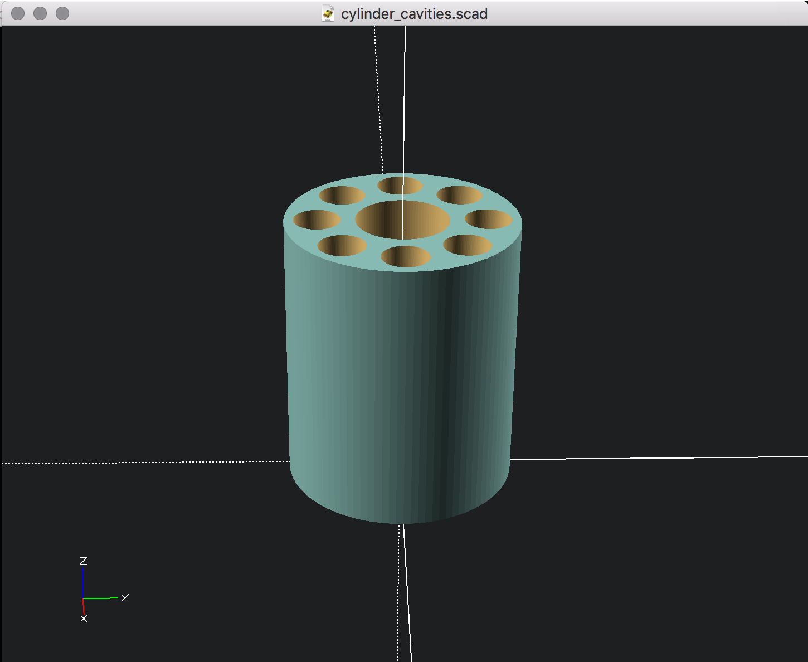

Aqui el titulo
==============

Descripción

  
  
  

## OpenScad ##
For the design of these pieces we have used the Openscad software. Openscad is free software, it is built by the community. It has a strong use in community makers.

OpenScad allows to make a parametric design, allowing the improvement of the pieces in a simple way.

## Uso ##
The use is simple. It's a cross-platform software you can download [here](http://www.openscad.org/). If you open the file with the part code the Openscad viewer will render the piece. Once rendered you will be able to export this piece to the most convinient format, STL is the standard of most 3D printers.

We have created a "stl" directory with some stable versions of these pieces.

## Other software ##
You can manipulate these files with Openscad u with other compatible software like Freecad. Freecad is authoring software for the design of 3D parts. It is a recommended alternative if you are not familarizado with the code
